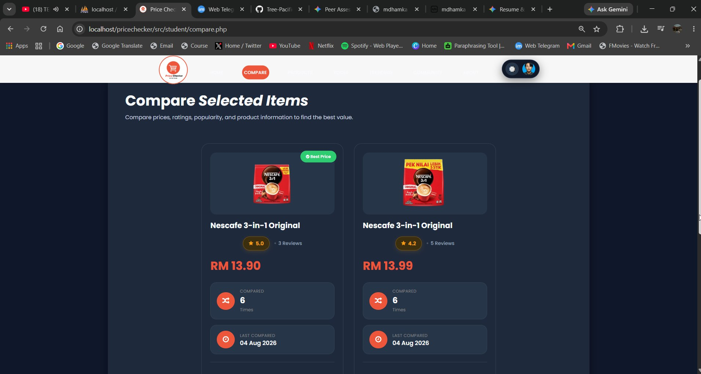

<div align="center">

# 🛒 Price Checker System

### A Modern Price Comparison & Analytics Platform for Students

Compare products • Analyze prices • Manage inventory • Community Forum • Reports & Analytics

---


</div>

---

# Overview

Price Checker System is a modern web application that enables students to compare grocery prices from multiple stores while providing administrators with powerful management, analytics, reporting, and monitoring capabilities.

Unlike a traditional CRUD application, this project focuses on delivering a production-style experience through interactive dashboards, real-time search suggestions, comparison tools, export capabilities, community features, activity logging, and system administration.

---

## Core Feature Preview

<div align="center">
  
  <p><em>Real-time Side-by-Side Product & Price Comparison Engine</em></p>
</div>

---

## Project Evolution

This project was originally developed as my **Final Year Project (FYP)** at **Universiti Malaysia Sarawak (UNIMAS)**.

After completing the initial academic project, I continued improving the system by redesigning the interface, expanding its functionality, and transforming it into a more complete **portfolio-level application**.

The current version introduces:

- Redesigned UI/UX
- Student price comparison features
- Admin dashboard and management tools
- Reports and analytics
- Export center
- Backup and restore
- Audit logging
- Wishlist and comparison history
- Community forum
- Dark mode support
- Responsive design
- Role-based permissions

This repository represents the continuous improvement and evolution of the original project idea.

---

## Repository

Initial Version Branch

https://github.com/mhdhamka/Price-Checker-System/tree/initial-version

---
# Features

## Student Module

- Product search, filtering, sorting, and comparison
- Wishlist and comparison history
- Product ratings and reviews
- Search suggestions using AJAX
- Community forum
- Light/Dark mode support


## Admin Module

- Dashboard analytics
- Product, store, category management
- Student and administrator management
- Rating moderation
- Export reports
- Backup and restore database
- Audit logs

# Responsive Design

Optimized for:

- Desktop
- Laptop
- Tablet
- Mobile

---

# Tech Stack

## Backend

- PHP
- MySQL

## Frontend

- HTML5
- CSS3
- JavaScript
- AJAX
- jQuery
- Bootstrap

## Libraries

- Chart.js
- DomPDF
- PhpSpreadsheet
- Font Awesome

---

# Project Structure

```
Price-Checker-System/

admin/
student/
public/
config/
assets/
vendor/
database/
 └── db_pcs.sql
README.md
```
---

# License

This project is released under the MIT License.

Feel free to learn from, fork, and improve upon this project.

---

<div align="center">

If you found this project interesting, consider giving it a star!

Made with ❤️ by mdhamka

</div>
